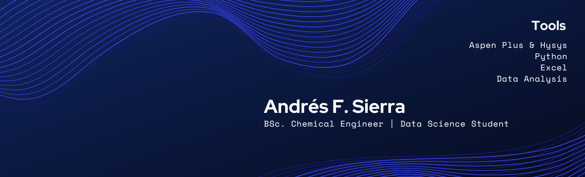

### Hello there, I'm Andrés Sierra 🛰
---

👨‍🔬I'm a **BSc. Chemical Engineer**

👨‍💻**Data Science Student**

📚**AIChE Student Chapter** Unipamplona (*Co-founder*)

🛰 **Platzi Campus Rep 2021**.

✨ I feel really passionate for Material Science, Nanotechnology and Machine Learning.

- 🌱 I’m currently learning Data Science and Machine Learning with [**UdeA**](https://asone.udea.edu.co/portafolio/#/catalog/1852) (Diplomaed), [**Platzi**](https://platzi.com/datos) (Learning Path) and [**DataCamp**](https://app.datacamp.com/learn/career-tracks/data-scientist-with-python?version=6) (Career Track)

- 📫 My personal [**Linkedin**](https://www.linkedin.com/in/andresf-sierra/) and [**CvLAC**](https://scienti.minciencias.gov.co/cvlac/visualizador/generarCurriculoCv.do?cod_rh=0000138045)

## Personal Projects and Portfolio💻
Still under construction...
But you can check it out my CV [**here**](https://github.com/andresf-sierra/andresf-sierra/blob/0efe30bac533610062092b0e41450aff0bef6d69/CV%20ENG%20-%20Andr%C3%A9s%20Felipe%20Sierra%20%C3%81lvarez%20IQ.pdf)

## My Stack ⚡

 ## Spotify Playing 🎧
 

  

<!--
**andres-sierra/andres-sierra** is a ✨ _special_ ✨ repository because its `README.md` (this file) appears on your GitHub profile.

Here are some ideas to get you started:

- 🔭 I’m currently working on ...
- 🌱 I’m currently learning ...
- 👯 I’m looking to collaborate on ...
- 🤔 I’m looking for help with ...
- 💬 Ask me about ...
- 📫 How to reach me: ...
- 😄 Pronouns: ...
- ⚡ Fun fact: ...
-->
